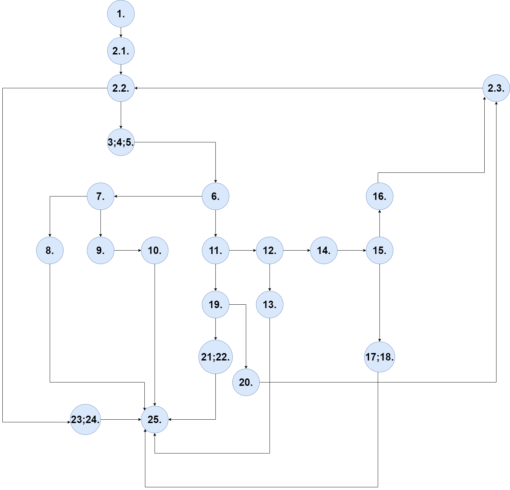
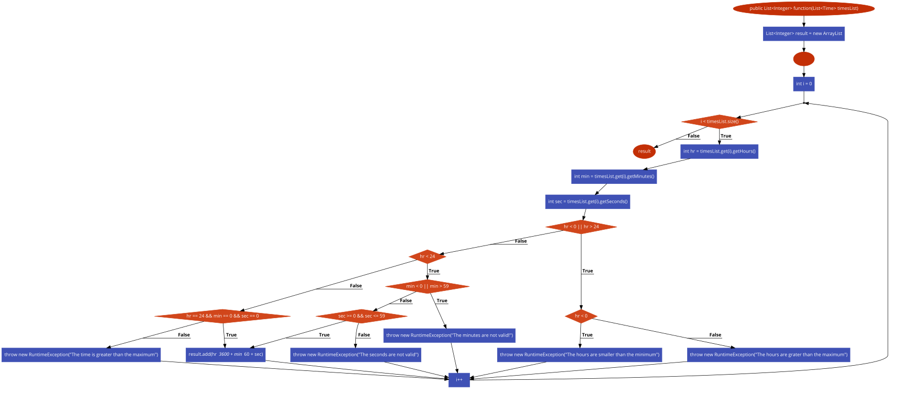
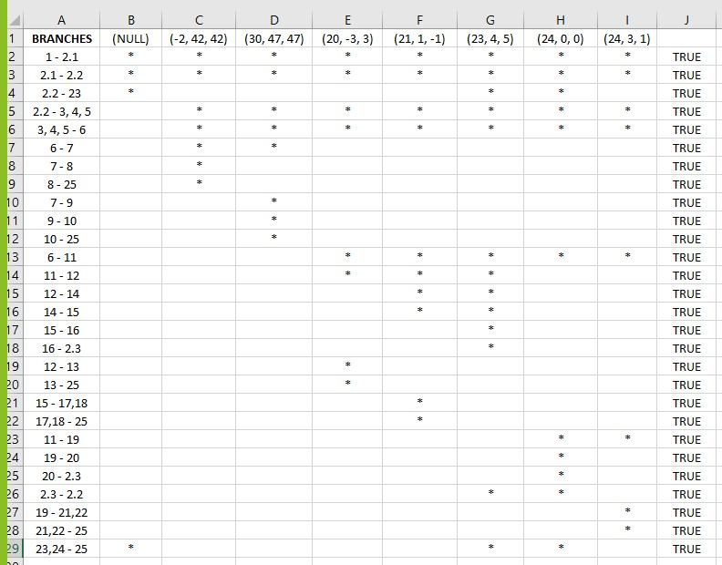

# SI_lab2_151193

Втора лабораториска вежба по предметот Софтверско инженерство.

Изработи: Владимир Стоилов, индекс број: 151193.

1. Кодот го превземав и средив соодветно според првото барање.

2. CFG Diagram

Дијаграмот го нацртав во draw.io, го прикачив и изворниот фајл.

Слика 1 CFG:

Слика 2 CFG:

Втората слика е од автоматизирана страна, каде што ми го исцрта и така си ја проверив логиката.

3. 

E=број на ребра=31;

V=број на темиња=25;

E - V + 2 = 31 - 25 + 2 = 8.

Според пресметките заклучувам дека цикломатската комплексност на кодот е 8.

4. Според Multiple Condition критериумот ги анализирав и тестирав 4 повеќекратни if услови.
        
a.) if (hr < 0 || hr > 24) 

Tochno||Nevazhno : (-2, 0, 0)
Netochno||Tochno : (26, 0, 0)
Netochno||Netochno : (1, 0, 0)

b.) if (min < 0 || min > 59) 

Tochno||Nevazhno : (0, -2, 0)
Netochno||Tochno : (0, 60, 0)
Netochno||Netochno : (0, 1, 0)
           
c.) if (sec >= 0 && sec <= 59)

Tochno&&Tochno : (0, 0, 59)
Netochno&&Nevazhno : (0, 0, -1)
Tochno&&Netochno : (0, 0, 60)

d.) if (hr == 24 && min == 0 && sec == 0)
		
Tochno&&Netochno&&Nevazhno : (24, 1, 0)
Tochno&&Tochno&&Netochno : (24, 0, 1)
Tochno&&Tochno&&Tochno : (24, 0, 0)
			  
5. Според Every branch критериумот со помош на табелата во  Еxcel (го прикачив фајлот) ги напишав сите тест случаи со цел да ги изминам сите ребра во дијаграмот. 

Слика 3:	   

Соодветните тест случаи детално се прикажани на сликата или може да ги видите во excel документот.

(NULL)	
(2, 42, 42)	
(30, 47, 47)
(20, -3, 3)
(21, 1, -1)
(23, 4, 5)	
(24, 0, 0)	
(24, 3, 1)

6. Го направив овој чекор со кодот.	   
7. Oбјаснување за Unit тестовите:
   Направив два теста:  multipleCondition() и еveryBranch().
   Кај тестот еveryBranch() користам try-catch блок за фаќање на исклучоци, пришто со assertEquals се прави споредба на пораките.
   Додека, за multipleCondition() користам assertEquals за споредба на јазли меѓу листата резултат и функцијата function од даден јазел со време.
   Овие два теста успешно се извршија.